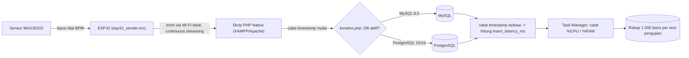

# Arsitektur & Skema Sistem — Tahap 1

**Judul Penelitian:** Analisis Perbandingan Performa Database MySQL dan PostgreSQL pada Sistem Pemantauan Data Sensor Detak Jantung Frekuensi Tinggi

**Status:** Selesai (sesuai WS-09 — Implementation)

---

## 1. Komponen Sistem

1. **ESP32 + Sensor MAX30102 (Client / Pengirim Data)** — membaca nilai detak jantung (BPM) dari sensor, lalu mengirimkannya secara *continuous streaming* melalui Wi-Fi lokal ke server. Firmware ditulis dan di-upload menggunakan **Arduino IDE** (`esp32_sender.ino`).
2. **Web Server Lokal (XAMPP / Apache)** — menjalankan skrip backend penangkap data. Folder skrip PHP diletakkan di `htdocs` XAMPP.
3. **Script Penerima / Logger (PHP Native)** — menerima paket data dari ESP32, mencatat timestamp sebelum dan sesudah eksekusi `INSERT` untuk menghitung *insert latency*, lalu menuliskannya ke database yang sedang aktif diuji. Koneksi ke database diatur lewat `koneksi.php`.
4. **Database Engine (dapat ditukar via konfigurasi)** — **MySQL 8.0** dan **PostgreSQL 15.x/16.x** diuji bergantian (satu aktif, satu dimatikan) pada kondisi jaringan dan beban yang identik. Ini adalah variabel independen (IV) penelitian.
5. **Resource Monitor (Task Manager, Windows 11)** — memantau pemakaian CPU/RAM server secara manual selama pengujian berlangsung, sebagai bagian dari variabel dependen (DV) kedua (beban server).

**Spesifikasi Environment Pengujian** (sesuai WS-09):

| Komponen | Spesifikasi |
|---|---|
| CPU | Intel Core i3 (Gen 12/13) |
| RAM | 8 GB / 16 GB DDR5 |
| OS | Windows 11 |
| Runtime Backend | PHP 8.x (Native) via XAMPP/Apache |
| Database | MySQL 8.0 & PostgreSQL 15.x/16.x |
| Firmware | Arduino IDE (ESP32) |

## 2. Alur Data Pengujian



**Prosedur eksekusi (sesuai WS-09 Latihan 3):**
1. Pastikan laptop dan ESP32 terhubung ke jaringan Wi-Fi yang sama dengan akses internet publik (bukan jaringan terisolasi) — latensi jaringan yang muncul dianggap sebagai faktor alami yang turut merepresentasikan kondisi implementasi IoT di dunia nyata (sesuai Batasan Masalah pada proposal).
2. Nyalakan service **MySQL** di XAMPP (pastikan PostgreSQL dalam kondisi mati).
3. Jalankan skrip backend PHP di browser, lalu nyalakan ESP32 agar mulai menembakkan data.
4. Pantau persentase RAM/CPU lewat Task Manager selama pengujian berjalan.
5. Setelah **1.000 baris data** masuk, catat rata-rata *insert latency* (ms), matikan MySQL, bersihkan cache, nyalakan **PostgreSQL**, lalu ulangi langkah 3–4 untuk kondisi pembanding.

Catatan penting:
- **Jaringan internet publik (bukan terisolasi):** pengujian sengaja dilakukan pada jaringan Wi-Fi dengan akses internet aktif, bukan jaringan lokal yang diisolasi. Ini konsisten dengan batasan masalah pada proposal — network latency dari koneksi publik dianggap sebagai bagian alami dari kondisi implementasi IoT nyata, bukan *confounding variable* yang perlu dihilangkan.
- **Fairness pengujian:** kedua database tetap diuji pada jaringan dan kondisi yang sama (bergantian, bukan bersamaan), dengan jumlah baris target yang sama (1.000 baris) dan frekuensi pengiriman data yang sama, sesuai prinsip *Controllability* di WS-06 — variasi latensi jaringan publik akan memengaruhi kedua database secara setara karena diuji berurutan pada rentang waktu yang berdekatan.

## 3. Skema Database

Struktur tabel dibuat sama persis di kedua engine agar hasil pengukuran dapat dibandingkan langsung. Nama tabel dan kolom mengikuti implementasi asli di `riset_db` (lihat phpMyAdmin).

**MySQL (`riset_db.log_jantung`):**
```sql
CREATE TABLE log_jantung (
    id           INT AUTO_INCREMENT PRIMARY KEY,
    nilai_sensor FLOAT    NOT NULL,   -- nilai detak jantung (BPM) dari MAX30102
    waktu        DATETIME NOT NULL    -- timestamp saat data diterima & disimpan server
);
```

**PostgreSQL (`riset_db.log_jantung`):**
```sql
CREATE TABLE log_jantung (
    id           SERIAL PRIMARY KEY,
    nilai_sensor REAL      NOT NULL,
    waktu        TIMESTAMP NOT NULL
);
```

> **Catatan soal *insert latency*:** tabel ini sengaja tidak menyimpan kolom `insert_latency_ms` — waktu simpan dihitung langsung di skrip PHP menggunakan `microtime(true)` sesaat sebelum dan sesudah query `INSERT` dijalankan, lalu selisihnya dicatat/ditampilkan di luar tabel (bukan jadi kolom database). Ini konsisten dengan definisi di [`tinjauan-pustaka.md`](tinjauan-pustaka.md) bagian 4 ("skrip pelacak waktu / microtime logging di sisi backend").
>
> **Beban server (CPU/RAM)** juga tidak disimpan sebagai tabel — dipantau manual lewat Task Manager sesuai WS-09, bukan direkam otomatis ke database.

## 4. Konfigurasi & Isolasi Variabel

Mengikuti prinsip *configuration-driven execution* dari WS-06, mode database ditentukan lewat file konfigurasi PHP, bukan hardcode di banyak tempat, supaya pengujian bisa diulang dengan konsisten:

**`koneksi.php`** — switch koneksi database (IV):
```php
<?php
// Ganti nilai $db_mode untuk berpindah kondisi eksperimen
$db_mode = "mysql"; // ganti "pgsql" untuk kondisi pembanding

if ($db_mode === "mysql") {
    $host = "localhost";
    $port = 3306;
    $dbname = "riset_db";
    $user = "root";
    $pass = "";
} else {
    $host = "localhost";
    $port = 5432;
    $dbname = "riset_db";
    $user = "postgres";
    $pass = "";
}
?>
```

**`esp32_sender.ino`** — konfigurasi pengirim data (CV dikunci sama untuk kedua kondisi):
```cpp
#define WIFI_SSID     "nama_wifi_lokal"
#define WIFI_PASSWORD "password_wifi"
#define SERVER_IP     "192.168.x.x"      // IP laptop server (XAMPP)
#define SEND_DELAY_MS 100                 // frekuensi kirim dikunci sama di kedua sesi
```

## 5. Keputusan Teknis (Final, sesuai WS-09)

1. **Firmware ESP32**: Arduino IDE (`.ino`), diupload langsung ke mikrokontroler.
2. **Bahasa script logger di server**: **PHP 8.x Native**, dijalankan via **XAMPP (Apache)**.
3. **Protokol transmisi ESP32 → server**: HTTP request ke skrip PHP di `htdocs` (ESP32 mengirim data sebagai parameter request).
4. **Cara pemantauan resource server**: manual via **Task Manager** (Windows 11), dicatat berupa persentase CPU/RAM.
5. **Target data per sesi**: 1.000 baris rekaman untuk tiap database yang diuji.
6. **Jumlah replikasi pengujian**: 35 run per database (sesuai batasan masalah pada proposal & WS-04/WS-14).

---

## Referensi Internal

- Konteks sistem (Input–Process–Output): lihat WS-02 Latihan 2.
- Pemetaan variabel ke komponen & 4 prinsip desain eksperimental: lihat WS-06 Latihan 1–2.
- Environment, installation, & execution lengkap: lihat WS-09 Latihan 3 (README Eksperimen).
- Definisi variabel & metrik lengkap: lihat [`tinjauan-pustaka.md`](tinjauan-pustaka.md) bagian 4.